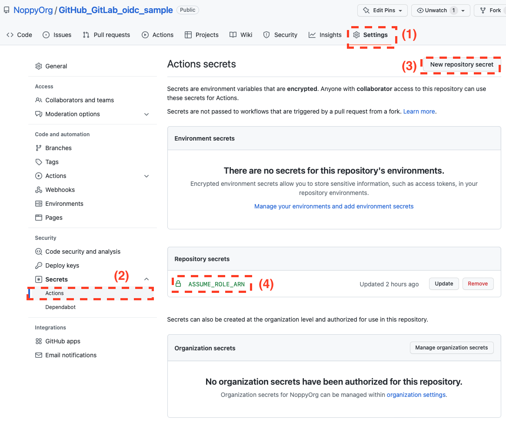

# GitHubでのAWS環境へのOIDCによる認証サンプル
このコードは、GitHubから、AWS環境にOIDC認証による接続を行い、
ActionsTerraformなどによるCI実行を行うためのサンプル実装です。


## セットアップ手順
## 事前準備
実行環境として`AdministratorAccess`権限でマネージメントコンソール操作が可能なユーザを用意します。

## GitHub CI環境のセットアップ
### GitHubのリポジトリ作成
- GitHubでリポジトリを作成します
- 作成したリポジトリのリポジトリ名を控えます(`ManagedeServiceCore/managed-service-terraform`など)

## AWS環境でのTerraform実行に必要なリソースの作成
GitHub Actionsによる実行および、Terraformの実行に必要なリソースをAWS環境に設定します。
具体的には以下のリソースを作成します。
- OIDC Provider
- IAMロール(GitHub ActionsからWebFederationによりAssumeRoleされる先のIAMロールであり、Terraformの実行ロール)
- Terraformのバックエンド用S3バケット
- Terraformのロック用DynamoDBテーブル

### OIDCプロバイダのサムプリント取得
OIDCプロバイダー設定のための事前情報取得として、OIDCプロバイダーのサムプリント(Thumbprint)を取得します。
サムプリントは、証明書の暗号化ハッシュです。

- GitHubまたはGitLabのOIDC
#### OIDC IdP設定情報取得先URLの指定
```shell
URL="https://token.actions.githubusercontent.com/.well-known/openid-configuration"

#確認
echo $URL
```
#### OIDC IdPの証明書取得

```shell
#ドメイン取得
FQDN=$(curl $URL 2>/dev/null | jq -r '.jwks_uri' | sed -E 's/^.*(http|https):\/\/([^/]+).*/\2/g')
echo $FQDN

#サーバー証明書の取得
 echo | openssl s_client -connect $FQDN:443 -servername $FQDN -showcerts | sed -ne '/BEGIN CERT/,/END CERT/p'
```
opensslコマンドを実行すると、次のような証明書が複数表示されます。 複数の証明書のうち表示される最後 (コマンド出力の最後) の証明書を特定します。

```
-----BEGIN CERTIFICATE-----
MIICiTCCAfICCQD6m7oRw0uXOjANBgkqhkiG9w0BAQUFADCBiDELMAkGA1UEBhMC
VVMxCzAJBgNVBAgTAldBMRAwDgYDVQQHEwdTZWF0dGxlMQ8wDQYDVQQKEwZBbWF6
<中略>
FFBjvSfpJIlJ00zbhNYS5f6GuoEDmFJl0ZxBHjJnyp378OD8uTs7fLvjx79LjSTb
NYiytVbZPQUQ5Yaxu2jXnimvw3rrszlaEXAMPLE=
-----END CERTIFICATE-----
```

証明書 (`-----BEGIN CERTIFICATE-----` および `-----END CERTIFICATE-----` 行を含む) をコピーして、テキストファイルに貼り付けます。次に、certificate.crt という名前でファイルを保存します。

```shell
cat > certificate.crt
最後の証明書を貼り付けて、最後にCTRL+Dで終了する

#ファイルの確認
cat certificate.crt
```
#### サムプリントの取得
証明書からサムプリントを取得します。`9999FD4D99BAB99FAADB99B9999999E3780AEA1`のような文字列が取得できれば成功です。
```shell
THUMBPRINT=$(openssl x509 -in certificate.crt -fingerprint -noout | sed -E 's/SHA1 Fingerprint=(.*)/\1/g' | sed -E 's/://g')

#取得したサムプリントの確認
echo $THUMBPRINT
```

#### サムプリント取得に関する参考情報
- [GitHub: About security hardening with OpenID Connect](https://docs.github.com/en/actions/deployment/security-hardening-your-deployments/about-security-hardening-with-openid-connect)
- [GitLab: GitLab as OpenID Connect identity provider](https://docs.gitlab.com/ee/integration/openid_connect_provider.html)
- [AWS IAMユーザガイド: OpenID Connect ID プロバイダーのサムプリントの取得](https://docs.aws.amazon.com/ja_jp/IAM/latest/UserGuide/id_roles_providers_create_oidc_verify-thumbprint.html)


### OIDCプロバイダー/IAMロール/S3バケット/DynamoDB作成
Terrafom実行に必要な、OIDCプロバイダー、IAMロール、バックエンド用のS3バケット、ロックテーブル用のDynamoDBテーブルをCloudFormationを利用し作成します。
スタックは、以下の内容で作成します。
- 対象リージョン: `東京リージョン( ap-northeast-1 )`
- スタック名: `terraform`
- テンプレート: `./src/setup_resources_for_github.yaml`
- パラメータ:
    - GitRepositoryName: `Actionsを実行するGitHubのリポジトリ名(Organizations名/リポジトリ名)`を指定
    - OidCIdPThumprint: `取得したサムプリント`を設定(デフォルトで指定済みですが、証明書が更新されている可能性があるため念の為確認すること)

スタックの出力に後続のGitHubやTerraformの設定で必要な内容が出力されるので確認します。
- GitHubへの設定に必要
    - `RoleArn` : GitHubからAssumeRoleする先のロール名
- Terraformコードへの設定に必要
    - `BackendBacketName` : Terraformのバックエンド用のS3バケット名
    - `LockStateTableName` : Terraformのロック用DynamoDBテーブルのテーブル名

## GitHubリポジトリ設定
GitHubリポジトリの`Actions Secrets`に`ASSUME_ROLE_ARN`というSecrets名でCloudFormationで作成したRoleのARNを指定します。
1. リポジトリの`Settings`に移動します。
1. 左のメニューから`Secrets`の`Actions`を選択します。
1. 右上の`New repository secret`を選び、下記設定をします。
    - `Name` :  `ASSUME_ROLE_ARN`と指定します。Actionsの中では`${{ secrets.ASSUME_ROLE_ARN }}`という形で呼び出されます。
    - `Value` : CloudFormationのスタックの出力に`RoleArn`で出力されているIAMロールのARNを設定します。
1. 設定されると`Repository secrets`に表示されます。

設定画面


##　Terraform変更
### 既存の developmentディレクトリの置き換え
`terraform/envs/template`フォルダの内容を、`terraform/envs/development`にコピーします。

### バックエンド設定の変更
`terraform/envs/template/backend.tf`で以下の二点を修正します。
- `bucket` : CloudFormationのスタックの出力の`BackendBacketName`を指定します。
-  `dynamodb_table` : CloudFormationのスタックの出力の`LockStateTableName`を指定します。

- `terraform/envs/template/backend.tf`
```
terraform {
  backend "s3" {
    bucket         = "<CFnで作成したバケットの名前>"
    key            = "development/terraform.tfstate"
    dynamodb_table = "<CFnで作成したDynamoDBのテーブル名>"
    region         = "ap-northeast-1"
  }
}
```
## Mainブランチへのプッシュ
Terraformコードの修正まで完了したら、コードをリーモートのmainブランチにpushします。
mainブランチにpushすると、Actionsでワークフローが自動実行されます。ワークフローが正常完了すれば成功です。